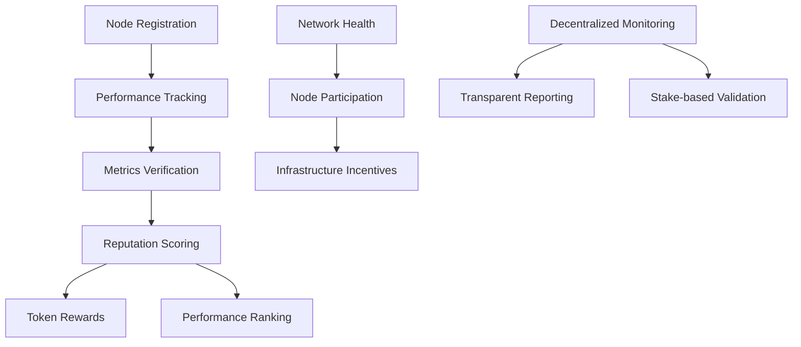

# Network Monitor: Decentralized Infrastructure Health Tracking

Network Monitor is a blockchain-powered system for tracking, monitoring, and incentivizing network infrastructure health and performance using smart contract technology.

## Overview

Network Monitor creates a comprehensive infrastructure tracking experience by:
- Monitoring network node health and performance
- Rewarding nodes for consistent uptime and reliability
- Tracking performance metrics across distributed networks
- Providing incentives for maintaining high-quality infrastructure
- Managing a reputation and token economy for network contributors

## Architecture

The system is built around a core smart contract that handles:



Core components:
- Node profiles with performance history and metrics
- Performance verification system with decentralized validation
- Reputation and token reward calculations
- Network health monitoring mechanism
- Stake-based infrastructure validation

## Contract Documentation

### Network Monitor Core Contract

The main contract (`network-monitor`) manages all core functionality:

#### Key Features
- Node registration and profile management
- Performance metric tracking and verification
- Token minting for infrastructure contributions
- Reputation scoring and bonus calculations
- Network health monitoring system
- Decentralized infrastructure validation

#### Access Control
- Contract owner: Can manage validators and update parameters
- Authorized validators: Can verify node performance and metrics
- Nodes: Can register, submit metrics, and claim rewards

## Getting Started

### Prerequisites
- Clarinet
- Stacks wallet for deployment

### Basic Usage

1. Register a network node:
```clarity
(contract-call? .network-monitor register-node)
```

2. Submit performance metrics:
```clarity
(contract-call? .network-monitor submit-metrics u100 u99.5)
```

3. Get node profile:
```clarity
(contract-call? .network-monitor get-node-profile tx-sender)
```

## Function Reference

### Node Management
- `register-node()`: Register a new network node
- `get-node-profile(principal)`: Get node's performance profile

### Performance Tracking
- `submit-metrics(uint, uint)`: Submit node performance metrics
- `verify-metrics(principal, uint)`: Verify submitted metrics
- `get-node-metrics(principal, uint)`: Retrieve specific node metrics

### Token Operations
- `get-token-balance(principal)`: Check node reward balance
- `transfer-tokens(principal, uint)`: Transfer tokens between nodes

### Network Validation
- `create-validation-round(uint, uint)`: Initiate a network validation round
- `participate-in-validation(uint)`: Join a validation round
- `submit-validation-proof(uint, uint)`: Submit validation evidence

## Development

### Testing
1. Clone the repository
2. Run Clarinet console:
```bash
clarinet console
```
3. Execute test commands:
```clarity
(contract-call? .fitnest-core register-user)
```

### Local Development
1. Install Clarinet
2. Initialize project:
```bash
clarinet new fitnest-project
```
3. Copy contract code to `contracts/fitnest-core.clar`

## Security Considerations

### Limitations
- Workout verification relies on authorized verifiers
- Challenge rewards are distributed after challenge completion
- Token transfers are irreversible

### Best Practices
- Only use authorized verifiers for workout validation
- Verify challenge parameters before joining
- Maintain sufficient token balance for challenge participation
- Be aware of challenge deadlines and conditions